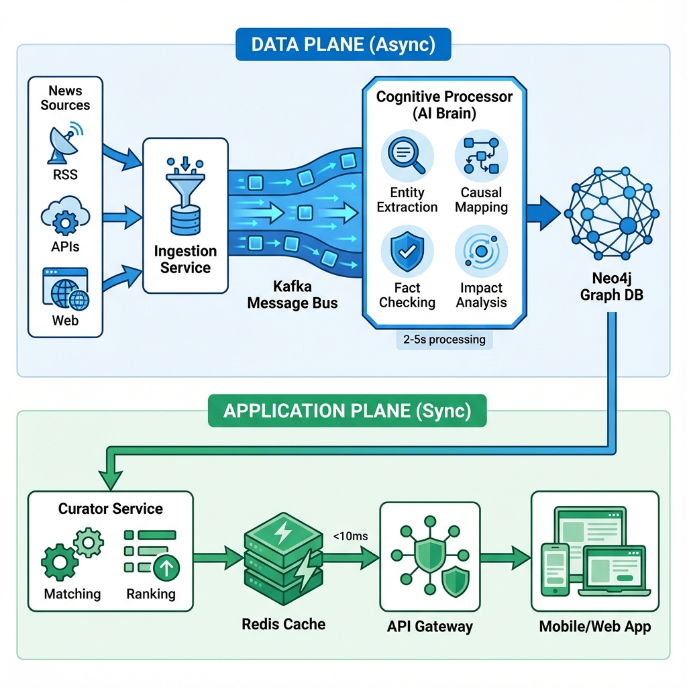

# News Curator - Event-Driven Microservices Platform

An intelligent news curation platform that uses AI to analyze, graph, and personalize news based on causal impact analysis.

## Architecture



This system follows an **Event-Driven Microservices** pattern with two distinct planes:

### Data Plane (Async)
- **Ingestion Service**: Fetches news from RSS/APIs
- **Cognitive Processor**: AI-powered entity extraction, causal mapping, and impact analysis
- **Graph Manager**: Maintains knowledge graph in Neo4j

### Application Plane (Sync)
- **Curator Service**: Matches news to user interests via graph + vector search
- **API Gateway**: Serves personalized feeds to users

## Tech Stack

| Component | Technology |
|-----------|-----------|
| **Message Bus** | Apache Kafka |
| **Knowledge Graph** | Neo4j (with APOC & GDS) |
| **Vector Database** | Pinecone |
| **Relational DB** | PostgreSQL |
| **Cache** | Redis |
| **AI/LLM** | OpenAI GPT-4 / Llama 3 |
| **NLP** | Spacy |
| **API** | FastAPI |
| **Orchestration** | Docker Compose (dev) / Kubernetes (prod) |

## Quick Start

### Prerequisites
- Docker & Docker Compose
- OpenAI API key
- (Optional) Pinecone API key
- (Optional) Crunchbase API key for fact-checking

### Setup

1. **Clone and configure**:
```bash
cp .env.example .env
# Edit .env with your API keys
```

2. **Start infrastructure**:
```bash
docker-compose up -d
```

3. **Verify services**:
```bash
# Check all containers are healthy
docker-compose ps

# Access Neo4j Browser
open http://localhost:7474

# Check Kafka topics
docker exec -it kafka kafka-topics --list --bootstrap-server localhost:9092
```

## Cognitive Processor Deep Dive

The **Cognitive Processor** is the brain of the system. It transforms raw news text into structured knowledge.

### Processing Pipeline

```
Raw Article → Entity Extraction → Causal Mapping → Fact Checking → Impact Summary → Graph Event
```

#### 1. Entity Extraction
**Hybrid Approach**: Spacy NER + LLM Refinement

```python
from services.cognitive.entity_extractor import EntityExtractor

extractor = EntityExtractor()
entities = extractor.extract(article_text)
# Returns: [Entity(name="Tesla", type="company", industry="EVs", confidence=0.95), ...]
```

**Output**: Companies, People, Locations, Events with confidence scores

#### 2. Causal Relationship Mapping
**LLM-Powered**: Extracts `Subject → Action → Object` triples

```python
from services.cognitive.causal_mapper import CausalMapper

mapper = CausalMapper()
relationships = mapper.extract_relationships(article_text, entities)
# Returns: [CausalRelationship(subject=FDA, action="REJECTS", object=PharmaCorp, sentiment=-0.8)]
```

**Features**:
- Chain-of-thought reasoning
- Sentiment analysis (-1.0 to +1.0)
- Confidence scoring

#### 3. Fact Checking
**External Validation**: Prevents hallucinations

```python
from services.cognitive.fact_checker import FactChecker

checker = FactChecker()
validated_entities, hallucinations = checker.validate_batch(entities)
# Checks against Crunchbase (companies) and Wikidata (people/locations)
```

#### 4. Impact Summarization
**Executive Summary**: 2-sentence business impact + severity score

```python
from services.cognitive.impact_summarizer import ImpactSummarizer

summarizer = ImpactSummarizer()
impact = summarizer.generate_summary(article_text, entities, relationships)
# Returns: ImpactSummary(severity=7/10, affected_sectors=["Pharma", "Healthcare"])
```

### LLM System Prompts

The Cognitive Processor uses carefully crafted prompts with **few-shot learning**:

- **Entity Extraction**: See [`prompts.py:ENTITY_EXTRACTION_SYSTEM_PROMPT`](services/cognitive/prompts.py)
- **Causal Mapping**: See [`prompts.py:CAUSAL_RELATIONSHIP_SYSTEM_PROMPT`](services/cognitive/prompts.py)
- **Impact Summary**: See [`prompts.py:IMPACT_SUMMARIZATION_SYSTEM_PROMPT`](services/cognitive/prompts.py)

All prompts include:
- Clear role definitions
- Output schema specifications
- Hallucination prevention rules
- Few-shot examples

### Testing the Cognitive Processor

**Standalone Test** (without Kafka):
```bash
cd services/cognitive
python entity_extractor.py
python causal_mapper.py
python impact_summarizer.py
```

**Full Pipeline Test**:
```bash
# 1. Produce a test article to Kafka
python scripts/test_producer.py

# 2. Watch Cognitive Processor logs
docker logs -f cognitive-processor

# 3. Check output topic
python scripts/test_consumer.py
```

## Development

### Project Structure
```
news-curator/
├── services/
│   ├── cognitive/          # AI processing service ⭐
│   ├── ingestion/          # Data collection
│   ├── graph-manager/      # Neo4j management
│   ├── curator/            # Matching & ranking
│   └── api-gateway/        # User-facing API
├── shared/
│   ├── models/             # Pydantic event models
│   ├── config/             # Centralized settings
│   └── utils/              # Logging, helpers
├── infrastructure/
│   └── docker/             # Service Dockerfiles
└── docker-compose.yml
```

### Key Design Decisions

1. **Why Event-Driven?**
   - LLM processing is slow (2-5 seconds per article)
   - Users need instant feed retrieval
   - Separation allows independent scaling

2. **Why Hybrid Entity Extraction?**
   - Spacy: Fast, free, good recall
   - LLM: High precision, handles ambiguity
   - Combined: Best of both worlds

3. **Why Fact-Checking Layer?**
   - LLMs hallucinate (~5-10% of entities)
   - External validation (Crunchbase/Wikidata) catches most errors
   - Critical for financial/business news integrity

4. **Why Polyglot Persistence?**
   - Neo4j: Optimal for "impact trace" graph queries
   - PostgreSQL: User management, transactions
   - Redis: Sub-10ms feed retrieval
   - Pinecone: Semantic similarity at scale

## Observability

All services use **structured JSON logging**:

```json
{
  "timestamp": "2024-01-15T14:35:22Z",
  "level": "INFO",
  "service": "cognitive-processor",
  "message": "Article processing complete",
  "article_id": "abc123",
  "processing_time_seconds": 4.2,
  "entity_count": 8,
  "severity": 7
}
```

**Monitoring Stack** (TODO):
- Prometheus: Metrics collection
- Grafana: Dashboards
- Jaeger: Distributed tracing
- LangSmith: LLM performance

## Next Steps

### Phase 1 (Current)
- [x] Cognitive Processor
- [x] LLM prompts & entity extraction
- [x] Fact-checking layer
- [x] Docker Compose infrastructure

### Phase 2 (Next)
- [ ] Ingestion Service (RSS polling)
- [ ] Graph Manager (Neo4j integration)
- [ ] API Gateway (FastAPI)
- [ ] End-to-end testing

### Phase 3 (Future)
- [ ] Curator Service (matching + vector search)
- [ ] Kubernetes deployment
- [ ] Production monitoring
- [ ] Mobile app integration

## License

MIT

## Contributing

This is an architectural reference implementation. Contributions welcome!

---

**Built with ❤️ using Event-Driven Architecture and AI**
